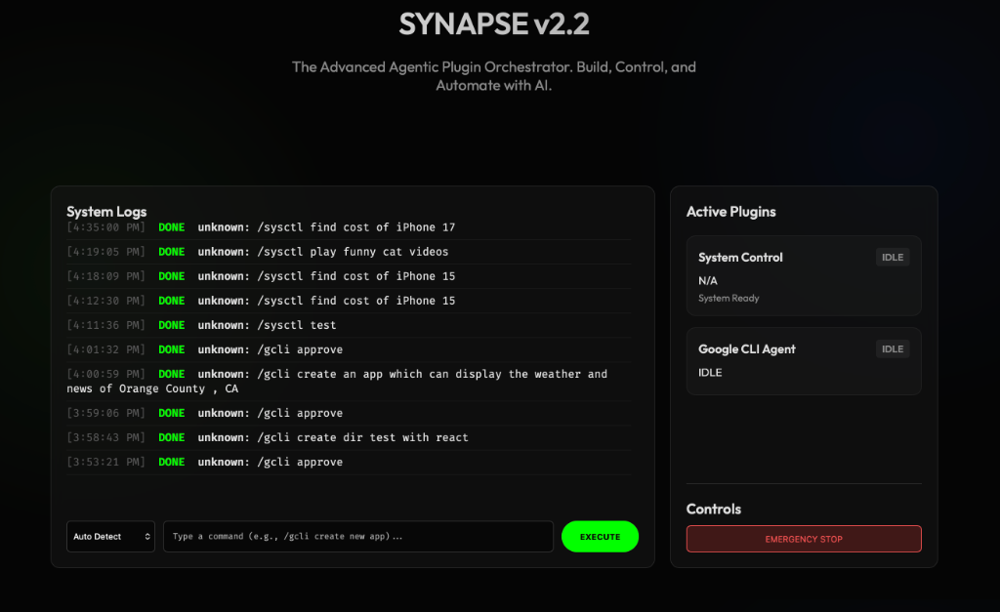

# Synapse v2.2 - Agentic Plugin Orchestrator 🧠🔌

**Synapse** is a modular, AI-powered bot framework designed to act as an intelligent agent on your system. It combines a Telegram interface, a Web Dashboard, and a hot-swappable plugin architecture to perform complex tasks ranging from coding to browser automation.


*(Note: Add a screenshot here)*

## 🚀 Features

### 1. **GCLI (Google CLI Agent)** 👨‍💻
*   **Autonomous Coding**: Generates full projects (React, Python, etc.) from natural language prompts.
*   **SDLC Management**: Handles Creation, Building (npm/pip), and Auto-Fixing of errors.
*   **Result**: Delivers code directly to your `Projects/` folder.

### 2. **System Control** 🖥️
*   **Browser Automation**: Opens a real Chrome browser to perform tasks.
    *   `/sysctl find cost of iphone 15` (Price Checking)
    *   `/sysctl play <video>` (YouTube Playback)
    *   `/sysctl download <url>` (File Acquisition)
*   **Terminal Access**: Execute safe shell commands via chat.

### 3. **Plugin Architecture** 🧩
*   **Modular**: Drop new Python scripts into `app/plugins/` to extend functionality instantly.
*   **Orchestrator**: Manages task queues, locking, and concurrency.
*   **Web Dashboard**: A Cyberpunk-themed UI (v2.2) to monitor logs and control agents.

---

## 🛠️ Installation

1.  **Clone the Repository**
    ```bash
    git clone https://github.com/aterry35/synapse.git
    cd synapse
    ```

2.  **Setup Environment**
    Copy the example env file and add your keys:
    ```bash
    cp example.env .env
    # Edit .env and add:
    # TELEGRAM_TOKEN=your_bot_token
    # GOOGLE_API_KEY=your_gemini_key
    ```

3.  **Install Dependencies**
    ```bash
    pip3 install -r requirements.txt
    ```

4.  **Run Synapse**
    Use the one-button start script:
    ```bash
    ./start_synapse.sh
    ```
    *   **Dashboard**: `http://127.0.0.1:8000/`
    *   **Telegram**: Start chatting with your bot!

---

## 🔮 Future Roadmap

We are building the ultimate AI Assistant. Here's what's coming:
*   [ ] **Voice Interface**: Real-time voice interaction via WebSockets.
*   [ ] **Docker Integration**: Sandboxed execution for generated code.
*   [ ] **Memory Module**: Long-term memory using Vector Databases.
*   [ ] **Smart Price Engine**: Advanced `/sysctl` logic that scrapes multiple sites (Amazon, eBay, etc.), compares prices, and returns **only** the link to the best deal.
*   [ ] **Marketplace**: A registry for community plugins.

---

## 🤝 Contributing & Community

**We need YOU!** Synapse is an open platform.
If you have an idea for a plugin (e.g., Home Automation, Crypto Trading, Data Analysis), build it and submit a PR!

1.  Fork the repo.
2.  Create your feature branch (`git checkout -b feature/AmazingPlugin`).
3.  Commit your changes (`git commit -m 'Add AmazingPlugin'`).
4.  Push to the branch (`git push origin feature/AmazingPlugin`).
5.  Open a Pull Request.

**Join the revolution.** Let's build the future of Agentic AI together.
